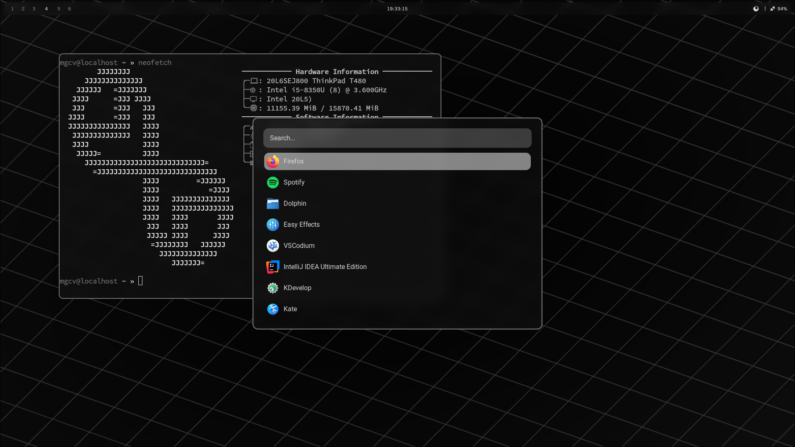
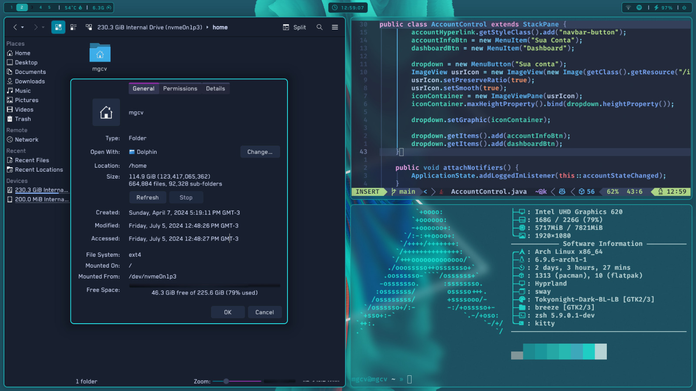
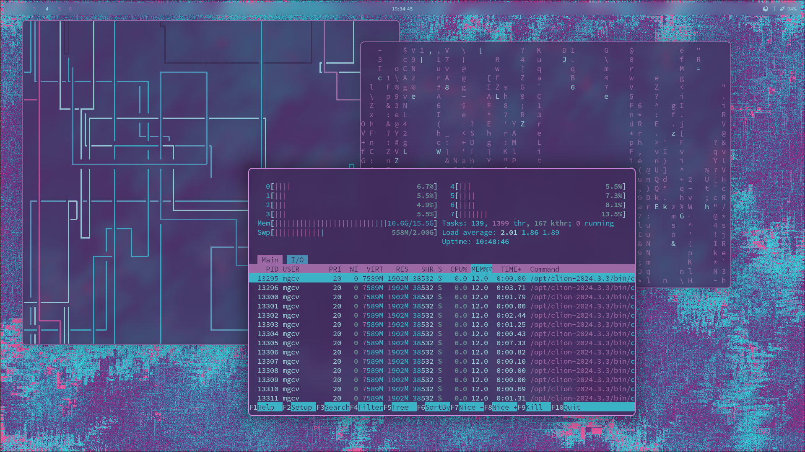
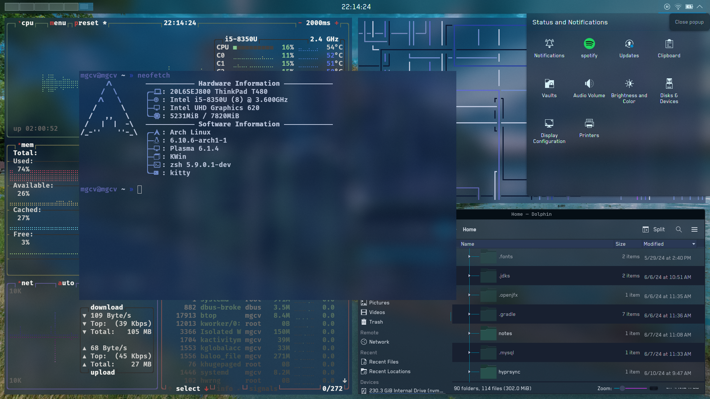

### Screenshots

### KDE

## Installation
- copy all the /config/ files into ~/.config
- copy the firefox/chrome folder into ~/.mozilla/firefox/{random bytes}.default-release/ and set  toolkit.legacyUserProfileCustomizations.stylesheets to true in about:config
- install the necessary dependencies (pywal, rofi, waybar, hyprland, grim, etc)
- youre done!

### Keybinds
I have custom keybinds setup in hyprland (capslk + j for left arrow, capslk + m for delete, etc).
For them to run properly, you must install keyd, and apply the propper configs (see /etc/keyd/default.conf)
